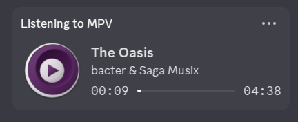

discord-mpris-bridge
====================

A dead simple tool to forward "listening to" status to Discord.

 

Minimal dependencies, just php-cli and dbus. Released under the WTFPLv2.

Usage
=====

~~~
git clone https://github.com/Artefact2/discord-mpris-bridge.git
cd discord-mpris-bridge
./bridge.php
~~~

Consider running the bridge as a user daemon to automatically run it in the background:

~~~
systemctl edit --user --force --full discord-mpris-bridge.service

[Unit]

[Service]
Type=simple
ExecStart=/XXXXXX/discord-mpris-bridge/bridge.php

[Install]
WantedBy=default.target

systemctl --user enable --now discord-mpris-bridge.service
~~~

Current limitations
===================

* Only MPV is supported, but support for any other players that support MPRIS is
  trivial.

* For now, IPC socket is hardcoded as `/run/user/1000/discord-ipc-0`. This means
  that Flatpak/Snap versions of Discord might not work (AppImage works fine). If
  your uid is not 1000, this will definitely not work (but can be easily changed
  in the source).

* No album art support, but it can be done in the future.

* No way to toggle on/off other than killing the bridge, be mindful of your
  privacy.
